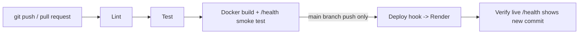

# StockGuard - Inventory & Expiry Intelligence System

StockGuard is a small dynamic web application that helps a shop, kitchen or pharmacy
keep track of what it has in stock and what is about to expire. The server builds
every page from live data, and every change goes through Git, an automated
CI/CD pipeline and a Docker-based deployment.

- **Live application:** `<paste your Render URL here>`
- **Repository:** `<paste your GitHub URL here>`
- **Pipeline runs:** `<repo URL>/actions`

## Features

| Area | What it does |
| --- | --- |
| Inventory items | Product name, category, quantity, purchase date, expiry date, supplier |
| Add products | Form with server-side validation (whole-number quantity, real dates, expiry not before purchase) |
| Expiry tracking | Days left are calculated on the server for every product |
| Expiring soon | Anything expiring in the next 7 days (today included) is flagged |
| Out of stock | Products with quantity 0 are flagged |
| Dashboard | Total products, Expiring this week, Out of stock, Expired |
| JSON API | `GET/POST /api/products`, `GET /api/expiry-alerts`, `GET /health` |
| Extra feature | Red **Expired** warning badge (plus red row highlight) for expired products |
| Footer | Shows the running commit ID so you can prove which version is live |

## Tech stack

| Layer | Technology |
| --- | --- |
| Runtime / language | Node.js 22, JavaScript (CommonJS) |
| Web framework | Express 4 |
| Templates | EJS (server-side rendering, auto-escaped output) |
| Styling | Plain CSS, no framework |
| Storage | In-memory store (resets on restart, as in the course examples) |
| Tests | `node:test` + `node:assert` (built into Node, no extra library) |
| Lint | ESLint 9 (flat config) |
| Container | Docker (`node:22-alpine`) |
| CI/CD | GitHub Actions |
| Hosting | Render (free tier) using a Deploy Hook |
| Version control | Git + GitHub (branches and pull requests) |

## Project structure

```
stockguard/
├── .github/workflows/ci-cd.yml   # the pipeline
├── docs/SUBMISSION_GUIDE.md      # step-by-step guide, report outline, viva answers
├── public/style.css              # dashboard styles (incl. red expired badge)
├── src/
│   ├── expiry.js                 # date parsing, days-until-expiry, status rules
│   ├── validate.js               # input validation for the add-product form/API
│   ├── inventory.js              # in-memory store, dashboard stats, alert grouping
│   └── seed.js                   # demo data shown on first start
├── test/
│   ├── app.test.js               # API + page tests
│   ├── badge.test.js             # red expired badge (extra feature)
│   └── expiry.test.js            # expiry calculation unit tests
├── views/index.ejs               # dashboard page
├── app.js                        # Express app factory (routes)
├── server.js                     # starts the server
├── Dockerfile
├── eslint.config.js
└── package.json
```

## Run locally

Requirements: Node.js 20 or newer (22 recommended) and Git.

```bash
npm install
npm start            # http://localhost:3000
```

Other commands:

```bash
npm test             # run all automated tests
npm run lint         # check code style
npm run dev          # restart automatically when files change
```

Set `SEED_DEMO_DATA=false` to start with an empty inventory. The port is read from the `PORT` environment variable.

### Run with Docker

```bash
docker build -t stockguard .
docker run -p 3000:3000 stockguard
```

## Business rules

| Term | Rule |
| --- | --- |
| Days left | expiry date minus today, in whole days (UTC calendar dates) |
| Expired | days left is below 0 (a product expiring *today* is not expired yet) |
| Expiring soon / this week | days left from 0 to 7 |
| Out of stock | quantity is exactly 0 |
| Valid quantity | whole number from 0 to 1,000,000 |

## API

| Method | Route | Description |
| --- | --- | --- |
| GET | `/api/products` | All products, soonest expiry first, with `daysUntilExpiry`, `expiryStatus`, `outOfStock` |
| POST | `/api/products` | Add a product. `201` with the product, or `400` with `details` per invalid field |
| GET | `/api/expiry-alerts` | Products that are expired, expiring soon, or out of stock. Optional `?days=14` (1 to 365) |
| GET | `/health` | `{"status":"ok","commit":"abc1234"}` |

Example:

```bash
curl -X POST http://localhost:3000/api/products \
  -H "Content-Type: application/json" \
  -d '{"name":"Milk 1L","category":"Dairy","quantity":10,
       "purchaseDate":"2026-09-18","expiryDate":"2026-09-25","supplier":"Amul"}'
```

Invalid quantity example (`"quantity": -5`) returns:

```json
{ "error": "Validation failed",
  "details": { "quantity": "Quantity must be a whole number, 0 or more" } }
```

## Automated tests

`npm test` runs 18 tests. They cover:

- Health route
- Adding a product (API and HTML form) and listing it
- Invalid quantity (negative, decimal, text, empty, null)
- Expiry calculation (today, tomorrow, yesterday, month/year/leap-year boundaries, invalid dates)
- Expiry alerts, dashboard counts and the red expired badge

Tests use a fixed date (`2026-06-15`), so they never fail because the real date changed.

## CI/CD pipeline



| Stage | Job | Runs on |
| --- | --- | --- |
| 1. Lint and test | `test` | every push and pull request |
| 2. Build | `build` (needs `test`) | every push and pull request |
| 3. Deploy | `deploy` (needs `build`) | push to `main` only |
| 4. Verify | `verify` (needs `deploy`) | after deploy; skipped if `LIVE_APP_URL` secret is not set |

If any stage fails, the later stages do not run, so broken code is never deployed.

### Required GitHub secrets

| Secret | Value |
| --- | --- |
| `RENDER_DEPLOY_HOOK` | Deploy Hook URL from Render, Settings, Deploy Hook |
| `LIVE_APP_URL` | (optional) your live URL, e.g. `https://stockguard.onrender.com`, no trailing slash |

### Render settings

| Setting | Value |
| --- | --- |
| Language | Docker |
| Auto-Deploy | **Off** (the pipeline triggers the deploy) |
| Health check path | `/health` |

## Screenshots

Add these after your pipeline has run (see `docs/SUBMISSION_GUIDE.md`):

- `docs/screenshots/pipeline-green.png`
- `docs/screenshots/pipeline-failed.png`
- `docs/screenshots/live-site.png`
